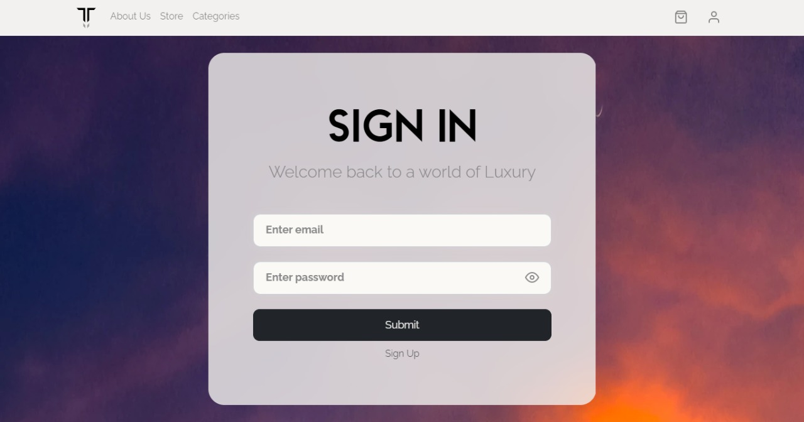
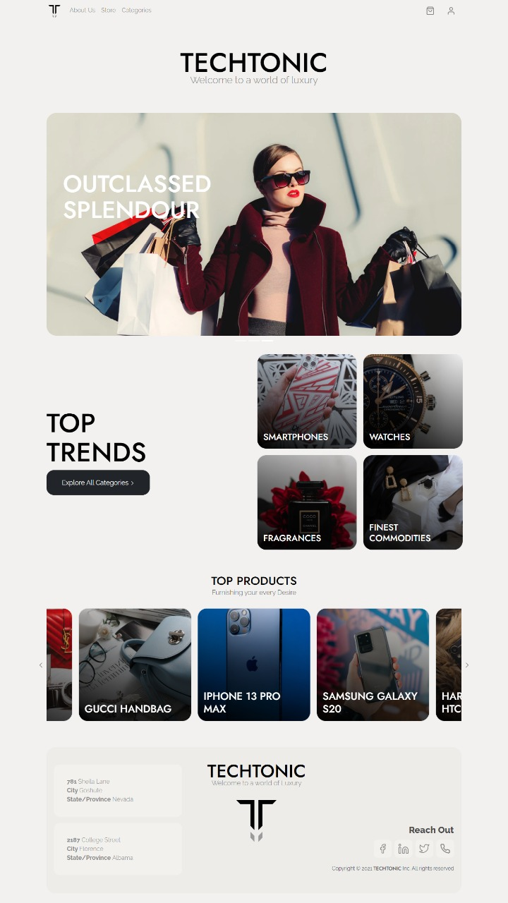
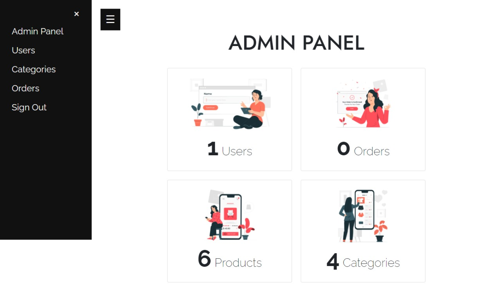
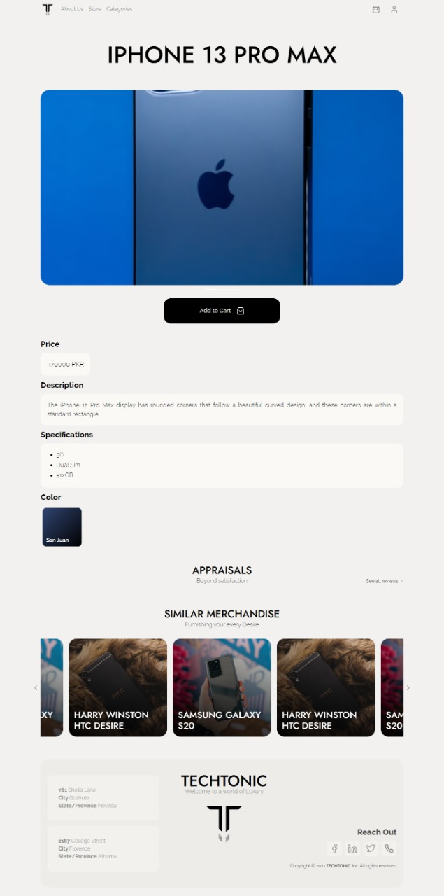
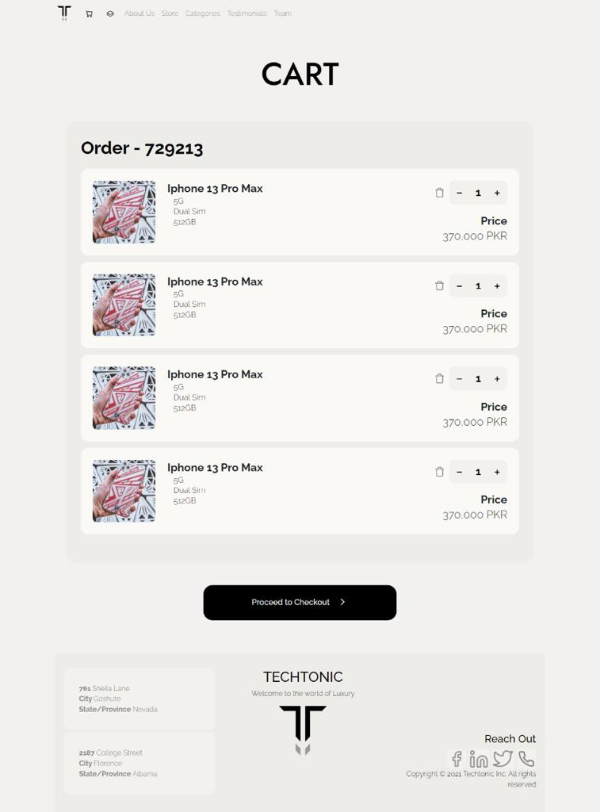
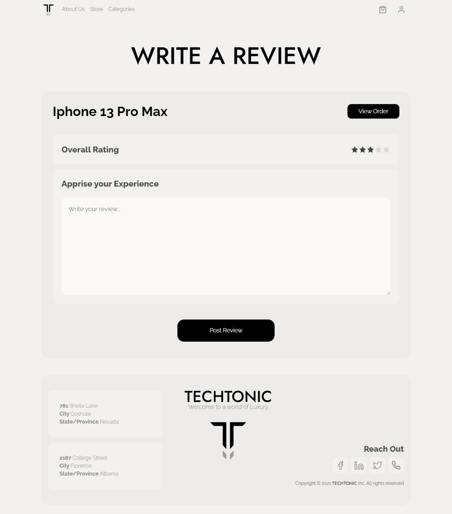

# Techtonic
Techtonic is a voguish purchasing platform developed using HTML, CSS, PHP and JavaScript. It allows the users to browse through various product categories and subsequently make purchases. It has all the features of a modern e-commerce application. Laravel has been used for backend development and Bootstrap v5 for the frontend alongside jQuery.

# Screenshots
Screenshots of some of the main features are shown below:

## Login and Sign Up

## Home

## Admin Panel

## Product Details

## Cart

## Checkout

## Leave a Review

## Categories

